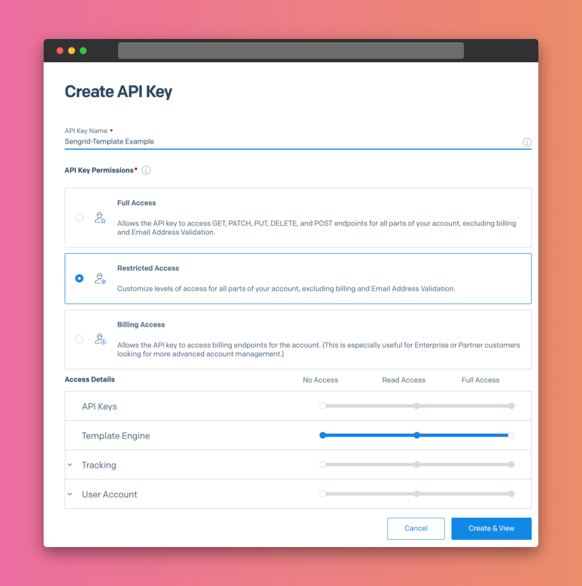

# Sengrid Dynamic Templates Bulk Updater

This tool helps you generate and upload Sendgrid Dynamic Templates in bulk.

If your system has more than a few templates, likely they all share the same header/footer and only the content is different.

What do you do when your logo or footer url changes? This tool to the rescue!

```shell
$ SENDGRID_API_KEY=your-api-key
$ yarn upload
The template directory is set to /Users/ddikman/code/sendgrid-dynamic-templates/templates. Is this correct? (y/n) y
Do you want to increase the version? (y/n) y
Enter the new version name: Aug-22 Footer update
Skipping non-HTML file: some-other-file.txt
Template [Login email] (d-a2176d95113e410caf19c145dc5e5882) version [Aug-22 Footer update] created
```

## Usage

1. You need to either add a `.env` file or set the `SENDGRID_API_KEY` in the current terminal.
2. Then add your html templates into the `templates/` folder, named by the ID of the template you have
3. Run `yarn upload` and answer the prompts

I recommend you start with just a single template file in the `templates/` directory to see if everything works as expected. You might even want to create a new template first and test with.

### Example

This repository comes with an example layout and emails. Since the emails need to be identified to match the `Dynamic Templates` created inside your own Sendgrid instance, these will not work on your Sendgrid but please refer to them as an example of how to name the files.

You will see how the filename of the email content files in the `emails` folder matches the ID of the template in Sendgrid:


### Command line tools

You can also install this globally and use it as a pure command line tool:

```
npm install -g sendgrid-dynamic-templates
download-sendgrid-templates
generate-sendgrid-templates
upload-sendgrid-templates
```

Or using `npx` to install if it isn't installed already.


## API Key requirements

For the API key, it only requires the `Template Engine` permissions so you can keep it slim reduce the risk.



## Generating template files

Although you can use this tool by just placing your email templates in the `templates/` folder and use only the upload function, you will likely want to generate your email templates using layouts as well.

You do this by adding your template layout in `layouts/your-template.html` and then your emails, prefixed with the template name in `emails/your-template_d-123xxx.html`.

When you run `yarn generate` that will loop through all emails in the `emails/` folder and output them to `templates/` replacing the `<!-- EMAIL CONTENT -->` with the contents of your email.

## Downloading existing templates

To make things even easier, you can also download the templates you have created already. For example, if someone manually updates one of the templates, you can use this tool to download all existing templates for the next bulk update. Just run `yarn download` or `npx download-sendgrid-templates`.

Please note that this action is destructive, it will overwrite any local templates.

## Limitations

You must have the template created in Sendgrid first with a version.

When downloading the templates, they will be as-they-are, meaning any previously applied template will have to be manually stripped and the layout name updated.